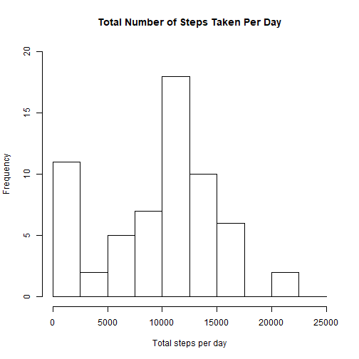
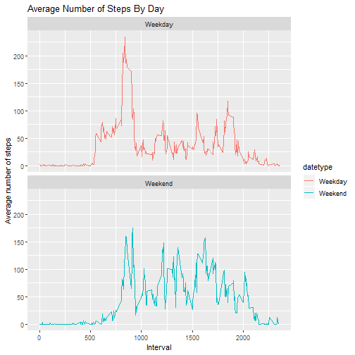

## Loading and preprocessing the data


```r
library(ggplot2)
activity<-read.csv("H:/R/Reproducible Research/activity.csv")

str(activity)
```

```
## 'data.frame':	17568 obs. of  3 variables:
##  $ steps   : int  NA NA NA NA NA NA NA NA NA NA ...
##  $ date    : Factor w/ 61 levels "2012-10-01","2012-10-02",..: 1 1 1 1 1 1 1 1 1 1 ...
##  $ interval: int  0 5 10 15 20 25 30 35 40 45 ...
```

```r
activity$date<-as.Date(activity$date)
```

## What is mean total number of steps taken per day?

37.3826
1. Calculate the total number of steps taken per day

```r
activity_total_steps <- with(activity, aggregate(steps, by = list(date), FUN = sum, na.rm = TRUE))
```

2.  Make a histogram of the total number of steps taken each day

```r
echo = TRUE
 hist(activity_total_steps$x, main = "Total Number of Steps Taken Per Day", xlab = "Total steps per day", ylim = c(0,20), breaks = seq(0,25000, by=2500))
```



3.Calculate and report the mean and median of the total number of steps taken per day

```r
mean(activity_total_steps$x)
```

```
## [1] 9354.23
```

```r
median(activity_total_steps$x)
```

```
## [1] 10395
```

## What is the average daily activity pattern?
1. Make a time series plot (i.e. \color{red}{\verb|type = "l"|}type="l") of the 5-minute interval (x-axis) and the average number of steps taken, averaged across all days (y-axis)

```r
head(activity)
```

```
##   steps       date interval
## 1    NA 2012-10-01        0
## 2    NA 2012-10-01        5
## 3    NA 2012-10-01       10
## 4    NA 2012-10-01       15
## 5    NA 2012-10-01       20
## 6    NA 2012-10-01       25
```

```r
average_daily_activity <- aggregate(activity$steps, by=list(activity$interval), FUN=mean, na.rm=TRUE)
head(average_daily_activity)
```

```
##   Group.1         x
## 1       0 1.7169811
## 2       5 0.3396226
## 3      10 0.1320755
## 4      15 0.1509434
## 5      20 0.0754717
## 6      25 2.0943396
```
2. Which 5-minute interval, on average across all the days in the dataset, contains the maximum number of steps?

```r
 echo = TRUE
plot(average_daily_activity$Group.1, average_daily_activity$x, type = "l", lwd = 2, xlab="Interval", ylab="Average number of steps", main="Average Number of Steps Per 5-min Interval")
```


```r
average_daily_activity[which.max(average_daily_activity$x), ]$Group.1
```

```
## [1] 835
```


## Imputing missing values
1. Calculate and report the total number of missing values in the dataset (i.e. the total number of rows with \color{red}{\verb|NA|}NAs)

```r
 sum(is.na(activity$steps))
```

```
## [1] 2304
```
2. Devise a strategy for filling in all of the missing values in the dataset. The strategy does not need to be sophisticated. For example, you could use the mean/median for that day, or the mean for that 5-minute interval, etc.

```r
names(average_daily_activity) <- c("interval", "mean") 
imputed_steps <- average_daily_activity$mean[match(activity$interval, average_daily_activity$interval)]
head(imputed_steps)
```

```
## [1] 1.7169811 0.3396226 0.1320755 0.1509434 0.0754717 2.0943396
```
3.Create a new dataset that is equal to the original dataset but with the missing data filled in.

```r
activity_imputed <- transform(activity, steps = ifelse(is.na(activity$steps), yes = imputed_steps, no = activity$steps))
total_steps_imputed <- aggregate(steps ~ date, activity_imputed, sum)
head(total_steps_imputed) 
```

```
##         date    steps
## 1 2012-10-01 10766.19
## 2 2012-10-02   126.00
## 3 2012-10-03 11352.00
## 4 2012-10-04 12116.00
## 5 2012-10-05 13294.00
## 6 2012-10-06 15420.00
```
4. Make a histogram of the total number of steps taken each day and Calculate and report the mean and median total number of steps taken per day. Do these values differ from the estimates from the first part of the assignment? What is the impact of imputing missing data on the estimates of the total daily number of steps?

```r
 echo = TRUE
hist(total_steps_imputed$steps,xlab = "Total steps per day", ylim = c(0,30), main = "Total number of steps taken each day", breaks = seq(0,25000,by=2500))
```


```r
mean(total_steps_imputed$steps)
```

```
## [1] 10766.19
```

```r
median(total_steps_imputed$steps)
```

```
## [1] 10766.19
```

## Are there differences in activity patterns between weekdays and weekends?
1. Create a new factor variable in the dataset with two levels – “weekday” and “weekend” indicating whether a given date is a weekday or weekend day.

```r
 activity$date <- as.Date(strptime(activity$date, format="%Y-%m-%d"))
activity$datetype <- sapply(activity$date, function(x) {
    if (weekdays(x) == "Saturday" | weekdays(x) =="Sunday") 
    {y <- "Weekend"} else 
    {y <- "Weekday"}
    y
})
head(activity)
```

```
##   steps       date interval datetype
## 1    NA 2012-10-01        0  Weekday
## 2    NA 2012-10-01        5  Weekday
## 3    NA 2012-10-01       10  Weekday
## 4    NA 2012-10-01       15  Weekday
## 5    NA 2012-10-01       20  Weekday
## 6    NA 2012-10-01       25  Weekday
```
2. Make a panel plot containing a time series plot (i.e. \color{red}{\verb|type = "l"|}type="l") of the 5-minute interval (x-axis) and the average number of steps taken, averaged across all weekday days or weekend days (y-axis). See the README file in the GitHub repository to see an example of what this plot should look like using simulated data.

```r
echo = TRUE
 activity_by_date <- aggregate(steps~interval + datetype, activity, mean, na.rm = TRUE)
plot<- ggplot(activity_by_date, aes(x = interval , y = steps, color = datetype)) +
    geom_line() +
    labs(title = "Average Number of Steps By Day", x = "Interval", y = "Average number of steps") +
    facet_wrap(~datetype, ncol = 1, nrow=2)
print(plot)
```




